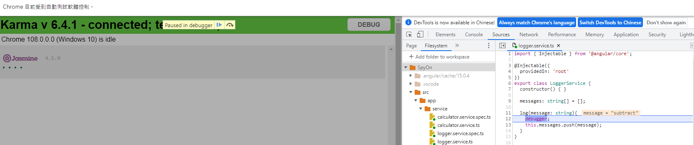
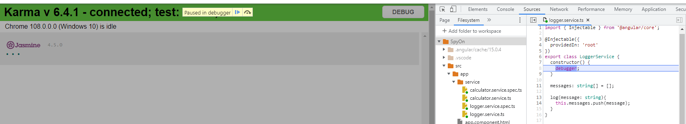

# SpyOn sample

## Create a new project

```
ng new SpyOn
ng g service service/calculator
ng g service service/logger
```

## Implement calculaor & logger service

- logger

  ```typescript
  export class LoggerService {
    constructor() { }
    messages: string[] = [];

    log(message: string){
      debugger; // <= focus here
      this.messages.push(message);
    }
  }
  ```

- calculator

  ```typescript
  export class CalculatorService {
    constructor(private service: LoggerService) { }
    
    add(n1: number, n2: number): number{
      this.service.log('add');
      return n1+n2;
    }

    subtract(n1: number, n2: number): number{
      this.service.log('subtract');
      return n1-n2;
    }
  }
  ```

## Implement calculaor service test

```typescript
describe('CalculatorService:', ()=>{
  it('should return 1+1=2', ()=>{
    //arrange
    let logService = new LoggerService();
    let service = new CalculatorService(logService);

    //act
    let returnVar = service.add(1, 1);

    //assert
    expect(returnVar).toBe(2);
  })

  it('should return 1-1=0', ()=>{
    //arrange
    let logService = new LoggerService();
    let service = new CalculatorService(logService);

    //act
    let returnVar = service.subtract(1, 1);

    //assert
    expect(returnVar).toBe(0);
  })
})
```

After we run **ng test**, it should like below picture:



It should suspand for twice, because we test the **subtract()** & **add()** function in calculaor.service.spec.ts

## Use SpyOn method

某些時候, 我們並不希望真的執行注入的服務, 正如同上述的, 若實際執行注入的服務, 會看到debuggere 被執行, 單元測試中, 為了盡可能孤立元件, 我們可以使用SpyOn來模擬注入的服務行為

```typescript
describe('CalculatorService:', ()=>{
  it('should return 1+1=2', ()=>{
    //arrange
    let logService = new LoggerService();
    spyOn(logService, 'log'); // <= Check here
    let service = new CalculatorService(logService);

    //act
    let returnVar = service.add(1, 1);

    //assert
    expect(returnVar).toBe(2);
  })

  it('should return 1-1=0', ()=>{
    //arrange
    let logService = new LoggerService();
    spyOn(logService, 'log'); // <= Check here
    let service = new CalculatorService(logService);

    //act
    let returnVar = service.subtract(1, 1);

    //assert
    expect(returnVar).toBe(0);
  })
})
```

為了驗證注入的服務方法是否啟動, 可以使用如下語法:

```typescript
expect(logService.log).toHaveBeenCalledTimes(1);
```

當我們希望注入的服務方法能依正常方式執行, 但又想驗證呼叫此方法的參數是否正確, 可以改寫如下:

```typescript
spyOn(logService, 'log').and.callThrough();
```

## Use CreateSpyObj mothod

現在將logger service 的 debugger 改寫至constructor, 如下:

```typescript
export class LoggerService {
  constructor() {
    debugger;
  }

  messages: string[] = [];

  log(message: string){
    this.messages.push(message);
  }
}
```

After we run **ng test**, it should like below picture:



debugger 總共會trigger 3 次: 

- 第一次: logger.service.spec.ts

  ```typescript
  service = TestBed.inject(LoggerService);
  ```

- 第二次 & 第三次: calculator.service.spec.ts

  ```typescript
  let logService = new LoggerService();
  ```

某些時候, 我們並不希望真的創建該注入服務的物件, 我們只是想要監聽該物件的某些功能, 並模擬該物件的行為, 改寫如下:

```typescript
describe('CalculatorService:', ()=>{
  it('should return 1+1=2', ()=>{
    //arrange
    //check here !!
    let mockLogService = jasmine.createSpyObj('LoggerService', ['log']);
    let service = new CalculatorService(mockLogService);

    //act
    let returnVar = service.add(1, 1);

    //assert
    expect(returnVar).toBe(2);
    expect(mockLogService.log).toHaveBeenCalledTimes(1);
  })

  it('should return 1-1=0', ()=>{
    //arrange
    //check here !!
    let mockLogService = jasmine.createSpyObj('LoggerService', ['log']);
    let service = new CalculatorService(mockLogService);

    //act
    let returnVar = service.subtract(1, 1);

    //assert
    expect(returnVar).toBe(0);
    expect(mockLogService.log).toHaveBeenCalledTimes(1);
  })
})
```

此時該建構函示debugger 只會被trigger 一次(來自logger.service.spec.ts)

## beforeEach()

beforeEach()將在每一個it()執行前都執行一次, 因此calculator.service.spec.ts可以簡化如下:

```typescript
describe('CalculatorService:', ()=>{
  let mockLogService: any;
  let service: CalculatorService;

  beforeEach(()=>{
    //arrange
    mockLogService = jasmine.createSpyObj('LoggerService', ['log']);
    service = new CalculatorService(mockLogService);
  })

  it('should return 1+1=2', ()=>{
    //act
    let returnVar = service.add(1, 1);

    //assert
    expect(returnVar).toBe(2);
    expect(mockLogService.log).toHaveBeenCalledTimes(1);
  })

  it('should return 1-1=0', ()=>{
    //act
    let returnVar = service.subtract(1, 1);

    //assert
    expect(returnVar).toBe(0);
    expect(mockLogService.log).toHaveBeenCalledTimes(1);
  })
})
```
