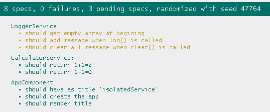

# Writing Isolated Unit Test Cases for an Angular Service

## 寫在前頭

請參考 [SpyOn](../SpyOn/README.md)創建相關服務

- create service

  ```
  ng new isolatedService
  ng g service service/calculator
  ng g service service/logger
  ```

- implement logger service

  ```typescript
  export class LoggerService {
    messages: string[] = [];
    log(message: string){
      this.messages.push(message);
    }
  }
  ```

- implement calculator service

  ```typescript
  import { LoggerService } from './logger.service';

  export class CalculatorService {
    constructor(private service: LoggerService) { }

    add(n1: number, n2: number): number{
      this.service.log('add');
      return n1+n2;
    }

    subtract(n1: number, n2: number): number{
      this.service.log('subtract');
      return n1-n2;
    }
  }
  ```

- test injection service: calculator.spec.ts

  ```typescript
  describe('CalculatorService:', ()=>{
    let mockLogService: any;
    let service: CalculatorService;

    beforeEach(()=>{
      //arrange
      mockLogService = jasmine.createSpyObj('LoggerService', ['log']);
      service = new CalculatorService(mockLogService);
    })

    it('should return 1+1=2', ()=>{
      //act
      let returnVar = service.add(1, 1);
      //assert
      expect(returnVar).toBe(2);
      expect(mockLogService.log).toHaveBeenCalledTimes(1);
    })

    it('should return 1-1=0', ()=>{
      //act
      let returnVar = service.subtract(1, 1);
      //assert
      expect(returnVar).toBe(0);
      expect(mockLogService.log).toHaveBeenCalledTimes(1);
    })
  })
  ```

The above code is same as [SpyOn](../SpyOn/README.md).<p>

Now, we run **ng test --code-coverage**, we should get the result

```
Statements   : 90.9% ( 10/11 )
Branches     : 100% ( 0/0 )
Functions    : 83.33% ( 5/6 )
Lines        : 90.9% ( 10/11 )
```

## 完成更多功能

Edit logger service like below

```typescript
export class LoggerService {
  messages: string[] = [];

  log(message: string){
    this.messages.push(message);
  }

  clear(){
    this.messages = [];
  }
}
```

Then we run **ng test --code-coverage** again, we should get the result

```
Statements   : 83.33% ( 10/12 )
Branches     : 100% ( 0/0 )
Functions    : 71.42% ( 5/7 )
Lines        : 83.33% ( 10/12 )
```

As you see, the **Functions: 71.42% (5/7)** was obtained, that is owing to we add a new function clear()

## 完成 logger service 的孤立測試

- 思考需要測試什麼

  ```typescript
  describe('LoggerService', () => {

    let service: LoggerService;

    beforeEach(()=>{
      service = new LoggerService();
    })

    it('should get empty array at begining', ()=>{
      pending();
    })

    it('should add message when log() is called', ()=>{
      pending();
    })

    it('should clear all message when clear() is called', ()=>{
      pending();
    })
  });
  ```

  

- 完善測試

  ```typescript
  it('should get empty array at begining', ()=>{
    expect(service.messages.length).toBe(0);
  })

  it('should add message when log() is called', ()=>{
    //act
    service.log('test');

    //assert
    expect(service.messages.length).toBe(1);
  })

  it('should clear all message when clear() is called', ()=>{
    //act
    service.log('test');
    service.clear();

    //assert
    expect(service.messages.length).toBe(0);
  })
  ```

- run ng test

  ```
  Statements   : 100% ( 12/12 )
  Branches     : 100% ( 0/0 )
  Functions    : 100% ( 7/7 )
  Lines        : 100% ( 12/12 )  
  ```
