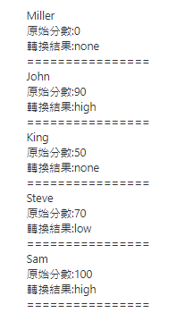

# Pipe

## 寫在開頭

每一個應用程式都是一些非常簡單的任務開始：獲取數據、轉換數據，並把它們顯示給用戶<p>
但我們撈取的資料未必就是符合要呈現在畫面上的樣子, 例如撈取小寫資料, 但畫面要大寫<p>
這時候就可以利用pipe來進行大小寫的轉換<br>

以下兩種情況, 會是使用Pipe的良好時機

- 轉換邏輯太複雜時

- 轉換邏輯在很多地方都需要使用時

<br>

以下兩種情況, 是撰寫pipe 的優點

- 關注點分離

- 易於測試

## 創建與使用 pipe

- 創建pipe

  ```
  ng g pipe score
  ```

- 撰寫pipe 功能

  ```typescript
  import { Pipe, PipeTransform } from '@angular/core';

  //管道的名字
  @Pipe({
    name: 'score'
  })
  export class ScorePipe implements PipeTransform {
    transform(value: any, args?: any): any {
      if (value >= 60 && value < 80) {
        return "low";
      } else if (value >= 80) {
        return "high";
      } else {
        return "none";
      }
    }
  }
  ```

- 撰寫測試數據: app.components.ts

  ```typescript
  heros = [
    { name: 'Miller', score: 0 },
    { name: 'John', score: 90 },
    { name: 'King', score: 50 },
    { name: 'Steve', score: 70 },
    { name: 'Sam', score: 100 },
  ]
  ```

- 於網頁中使用pipe: app.components.html

  ```html
  <span *ngFor="let hero of heros">
    <p>{{hero.name}}</p>
    <p>原始分數:{{hero.score}}</p>

    <!--Check here-->
    <p>轉換結果:{{hero.score | score}}</p>
    ================
  </span>
  ```

  

## 測試pipe

Edit score.pipe.spec.ts

```typescript
it('should show "low"', ()=>{
  //arrange
  const pipe = new ScorePipe();

  //asert
  expect(pipe.transform(60)).toBe('low');
})

it('should show "high"', ()=>{
  //arrange
  const pipe = new ScorePipe();

  //asert
  expect(pipe.transform(80)).toBe('high');
})

it('should show "none"', ()=>{
  //arrange
  const pipe = new ScorePipe();

  //asert
  expect(pipe.transform(59)).toBe('none');
})
```


