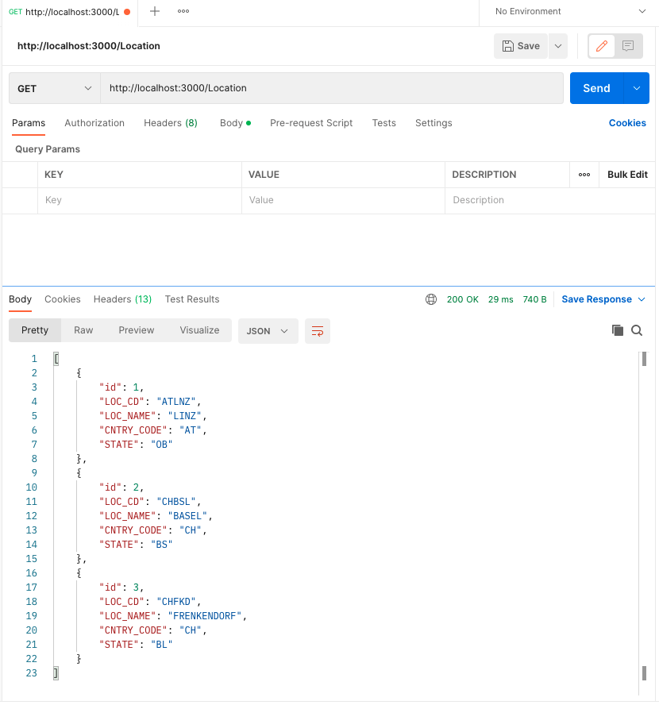
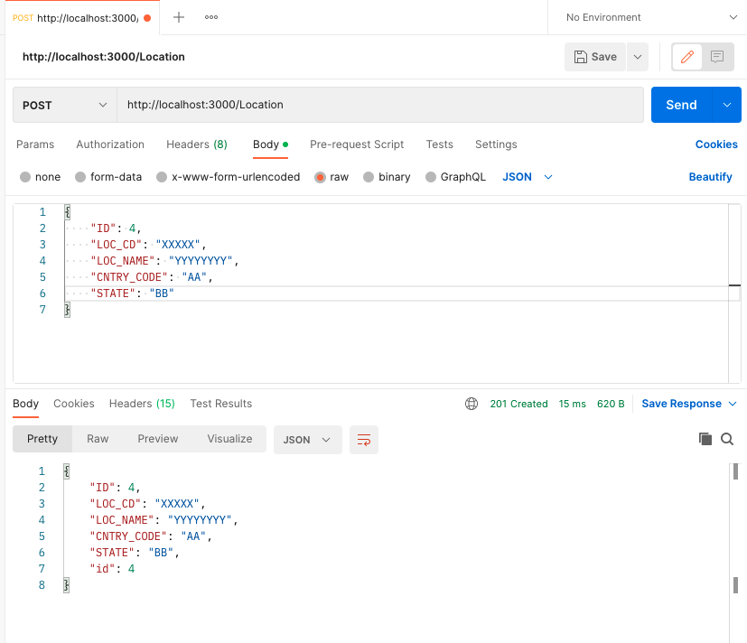
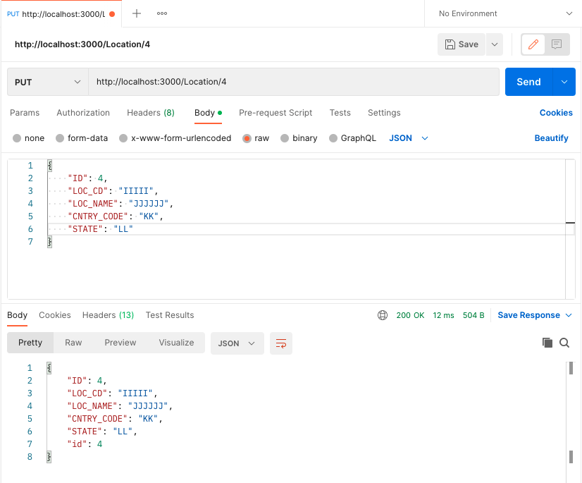
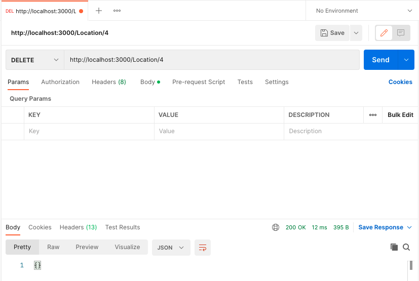
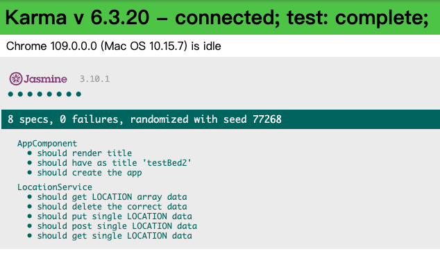

# testBed with HttpClient CRUD

## 寫在前頭

此專案請參照 [testBed](../testBed/README.md)創建相關服務

## Test CRUD with json-server

儘管單元測試實際上不會去後端要資料, 但實務上習慣先建好假資料, <p>
較方便後續建立 data model 的邏輯思考

- Install json-server

  ```
  npm install -g json-server
  ```

  - run json-server in windows

    ```
    json-server --watch db.json
    ```

  - run json-server in MacOS

    ```
    npx json-server --watch db.json --port 3000
    ```

- Edit db.json

  ```json
  {
    "Location": [
      {
        "id": 1,
        "LOC_CD": "ATLNZ",
        "LOC_NAME": "LINZ",
        "CNTRY_CODE": "AT",
        "STATE": "OB"
      },
      {
        "id": 2,
        "LOC_CD": "CHBSL",
        "LOC_NAME": "BASEL",
        "CNTRY_CODE": "CH",
        "STATE": "BS"
      },
      {
        "id": 3,
        "LOC_CD": "CHFKD",
        "LOC_NAME": "FRENKENDORF",
        "CNTRY_CODE": "CH",
        "STATE": "BL"
      }
    ]
  }
  ```

  The json-server first property should be "id" : 1

- Test Get in Postman

  

- Test Post (insert) in Postman

  

- Test Put (update) in Postman
  
  

- Test Delete in Postman

  

## location service CRUD

- Create a service & data model

  ```
  ng g service service/location
  cd src/app/
  mkdir model
  cd model
  vi location.ts
  ```

- Impletment data model

  ```typescript
  export interface LOCATION{
    ID: number;
    LOC_CD: string;
    LOC_NAME: string;
    CNTRY_CODE: string;
    STATE: string;
  }
  ```

- location service CRUD

  ```typescript
  export class LocationService {

    private url!: string;

    constructor(private http: HttpClient) {
      //Declaire json-server API
      this.url = 'http://localhost:3000/';
    }

    //get all LOCATION data
    getLocation(): Observable<LOCATION[]>{
      const acionUrl = 'Location'
      const url = this.url + acionUrl;
      return this.http.get<LOCATION[]>(url);
    }

    //get one LOCATION data
    getSingle(id: number): Observable<LOCATION>{
      const acionUrl = 'Location/' + id;
      const url = this.url + acionUrl;
      return this.http.get<LOCATION>(url);
    }

    //insert one LOCATION data
    postLocation(location: LOCATION): Observable<LOCATION> {
      const acionUrl = 'Location'
      const url = this.url + acionUrl;
      return this.http.post<LOCATION>(url, location);
    }

    //update one LOCATION data
    putLocation(id: number): Observable<LOCATION> {
      const acionUrl = 'Location/' + id
      const url = this.url + acionUrl;
      return this.http.put<LOCATION>(url, location);
    }

    //delete one LOCATION data
    deleteLocation(id: number): Observable<LOCATION> {
      const acionUrl = 'Location/' + id
      const url = this.url + acionUrl;
      return this.http.delete<LOCATION>(url);
    }
  }
  ```

## location service CRUD with TestBed test

  在正式的產品程式碼中，我們會在服務的建構式去注入 HttpClient，以便可以使用 HttpClient 的 get 等方法來呼叫後端服務。<p>
  不過在單元測試並不會與外部資源有任何的依賴性，因此我們必須在單元測試中利用假的 HttpClient 物件來模擬與驗證程式執行的結果。<p>
  為此 Angular 提供了 HttpClientTestingModules 來讓我們可以使用模擬的 httpClient 物件，<p>
  所以我們可以在 TestBed 的設定中去引用此模組，並取得型別為 HttpClientController 的 HttpClient 模擬物件

- 注入測試模組

  ```typescript
  import { LOCATION } from './../model/location';
  import { TestBed } from '@angular/core/testing';
  import { LocationService } from './location.service';
  import { HttpClientTestingModule, HttpTestingController } from '@angular/common/http/testing';

  describe('LocationService', () => {
    //宣告服務
    let service: LocationService;
    //宣告假的 HttpClient 物件來模擬與驗證程式執行的結果
    let mockHttp: HttpTestingController;
    //宣告資料模型
    let mockOneData: LOCATION;

    beforeEach(() => {
      //透過TestBed注入HttpClientTestingModule
      TestBed.configureTestingModule({
        imports: [HttpClientTestingModule]
      });
      service = TestBed.inject(LocationService);
      mockHttp = TestBed.inject(HttpTestingController);
    });
  })
  ```

- 後端服務請求的測試程式

  getLocation() 方法是回傳 Observable<LOCATION> 物件，所以在呼叫此方法時需要被訂閱，否則不會真的執行此方法。<p>
  而在訂閱方法內，則會去驗證所取得到的結果是否與預期相同，因此測試程式會寫成：

  ```typescript
  it('should get LOCATION array data', (done: DoneFn)=>{
    //arrange
    let location = [
      {
        "ID": 1,
        "LOC_CD": "ATLNZ",
        "LOC_NAME": "LINZ",
        "CNTRY_CODE": "AT",
        "STATE": "OB"
      },
      {
        "ID": 2,
        "LOC_CD": "CHBSL",
        "LOC_NAME": "BASEL",
        "CNTRY_CODE": "CH",
        "STATE": "BS"
      },
      {
        "ID": 3,
        "LOC_CD": "CHFKD",
        "LOC_NAME": "FRENKENDORF",
        "CNTRY_CODE": "CH",
        "STATE": "BL"
      }
    ]

    //act
    service.getLocation().subscribe({
      next: (res)=>{
        expect(res).toEqual(location);
        done();
      }
    })
  })
  ```

  在單元測試中的執行並不會實際去後端取得資料，主要使用 HttpTestingController 物件來模擬 httpClient 物件的行為。<p>
  因此在驗證上會利用 expectOne 方法，來檢查所請求的 URL 是否被請求過一次，進而驗證所發送的請求是否使用預期的方法。<p>
  最後利用 flush 方法來決定這個請求要傳回什麼樣的結果，這個結果就會是訂閱方法所得到的結果。

  ```typescript
  //act
  service.getLocation().subscribe({
    next: (res)=>{
        expect(res).toEqual(location);
        done();
    }
  })

  //assert
  const testRequest = mockHttp.expectOne('http://localhost:3000/Location');
  expect(testRequest.request.method).toBe('GET');
  testRequest.flush(location);
  ```

## 最後結果

請參考程式碼



```
✔ Browser application bundle generation complete.
Chrome 109.0.0.0 (Mac OS 10.15.7): Executed 8 of 8 SUCCESS (0.069 secs / 0.062 secs)
TOTAL: 8 SUCCESS

===Coverage summary ===
Statements   : 100% ( 22/22 )
Branches     : 100% ( 0/0 )
Functions    : 100% ( 6/6 )
Lines        : 100% ( 20/20 )
=======================
```
